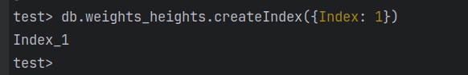
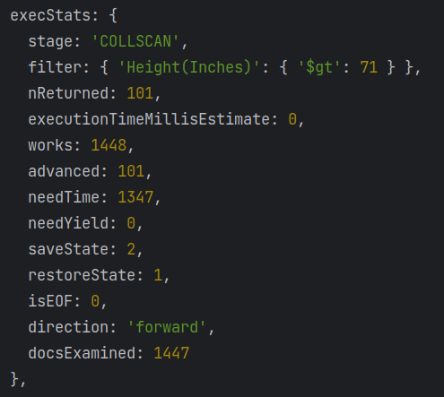

### Установка MongoDB

Сначала установим MongoDB в докер, для этого используем docker-compose файл и запустим его: `docker compose up`.

Далее необходимо установить `MongoDB Shell` и `MongoDB Compass`.

### Создание БД и заполнение ее данными
Добавим в БД данные из [источника](http://socr.ucla.edu/docs/resources/SOCR_Data/SOCR_Data_Dinov_020108_HeightsWeights.html),
я выбрал датасет по статистике веса/роста людей. Для установки скопируем `.csv` файл при
помощи `docker cp` и загрузим в БД при помощи `mongoimport`:
``` bash
mongoimport --type csv -d test -c weights_heights --headerline --drop SOCR_Data_Dinov_020108_HeightsWeights.csv 
```

Проверим, что все данные загружены:


### CRUD операции
Начнем с операции выборки:


Теперь исследуем время запросов, начнем с выборки:


Операция вставки:


И время ее работы:


Операция удаления:


Время ее работы:


Операция обновления:


Время ее работы:


### Индексирование

Создадим индекс и измерим время работы:


Время работы выборки:


Время работы удаления:


Время работы вставки:


Время работы обновления:


В итоге, операции поиска, обновления и удаления стали быстрее,
а вот операция вставки - медленнее. 