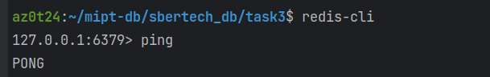
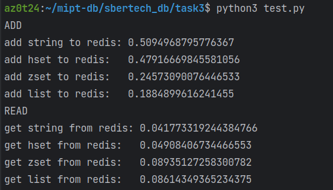
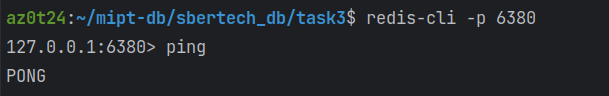
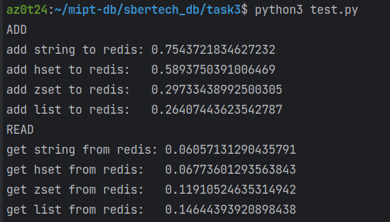

В качестве большого Json-файла я использую файл [из первой ссылки в гугле](https://github.com/json-iterator/test-data/blob/master/large-file.json).

### Тест на 1 ноде
Поднимем контейнер при помощи [`docker-compose.yaml`](redis/docker-compose.yaml),
расположенном в папке [`redis`](redis). Проверим, что он поднялся и работает:

Теперь при помощи файла [test.py](test.py) измерим скорость операций:

### Тест на 3 нодах
Теперь поднимем контейнер при помощи [`docker-compose.yaml`](redis_cluster/docker-compose.yaml),
находящимся в [`redis_cluster`](redis_cluster). Опять проверим, что все работает:

Теперь при помощи все того же файла [test.py](test.py) измерим скорость:

Как видим, время увеличилось, зато повысилась надежность нашей системы.